# Revisão de Lógica e Funções

## 🎯 Objetivos da Aula
- [ ] Compreender os conceitos de Revisão de Lógica e Funções
- [ ] Aplicar em problemas reais
- [ ] Analisar a eficiência da estrutura

## 🧠 Conceito Principal

!!! info "O que é?"
    Breve explicação sobre Revisão de Lógica e Funções.

### 📊 Representação Visual

```mermaid
graph TD
    A[Início] --> B[Processamento]
    B --> C{Decisão}
    C -->|Sim| D[Resultado 1]
    C -->|Não| E[Resultado 2]
```



## 💻 Exemplo Prático (C)

```c
#include <stdio.h>

int main() {
    printf("Exemplo de Revisão de Lógica e Funções\n");
    return 0;
}
```

### 🚀 Execução no Terminal

```termynal
$ gcc programa.c -o programa
$ ./programa
Exemplo de Revisão de Lógica e Funções
```

!!! tip "Dica de Ouro"
    Sempre verifique o uso de memória.

## 📝 Resumo
Nesta aula aprendemos sobre...

---
## 🏁 Próximos Passos

<div class="grid cards" markdown>

-   :material-presentation: **Acessar Slides**
    -   [Ver Slides da Aula](../slides/slide-02.html)

-   :material-school: **Quiz**
    -   [Responder Quiz](../quizzes/quiz-02.md)

-   :material-dumbbell: **Exercícios**
    -   [Lista de Exercícios](../exercicios/exercicio-02.md)

-   :material-rocket: **Projeto**
    -   [Mini Projeto](../projetos/projeto-02.md)

</div>
