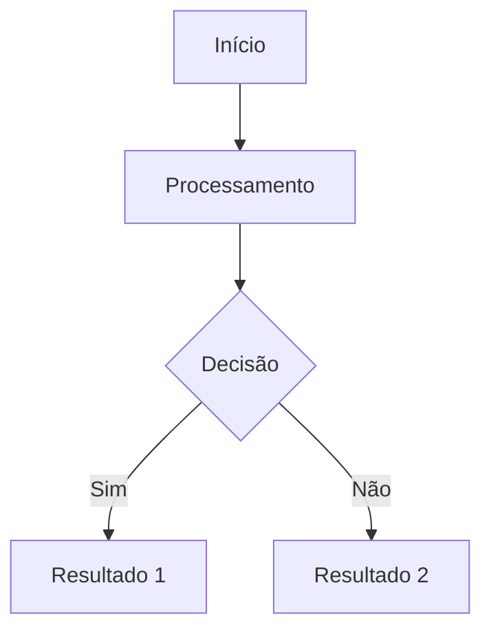

# Árvores de Busca Binária (BST)

## 🎯 Objetivos da Aula
- [ ] Compreender os conceitos de Árvores de Busca Binária (BST)
- [ ] Aplicar em problemas reais
- [ ] Analisar a eficiência da estrutura

## 🧠 Conceito Principal

!!! info "O que é?"
    Breve explicação sobre Árvores de Busca Binária (BST).

### 📊 Representação Visual



## 💻 Exemplo Prático (C)

```c
#include <stdio.h>

int main() {
    printf("Exemplo de Árvores de Busca Binária (BST)\n");
    return 0;
}
```

### 🚀 Execução no Terminal

```termynal
$ gcc programa.c -o programa
$ ./programa
Exemplo de Árvores de Busca Binária (BST)
```

!!! tip "Dica de Ouro"
    Sempre verifique o uso de memória.

## 📝 Resumo
Nesta aula aprendemos sobre...

---
## 🏁 Próximos Passos

<div class="grid cards" markdown>

-   :material-presentation: **Acessar Slides**
    -   [Ver Slides da Aula](../slides/slide-13.html)

-   :material-school: **Quiz**
    -   [Responder Quiz](../quizzes/quiz-13.md)

-   :material-dumbbell: **Exercícios**
    -   [Lista de Exercícios](../exercicios/exercicio-13.md)

-   :material-rocket: **Projeto**
    -   [Mini Projeto](../projetos/projeto-13.md)

</div>
