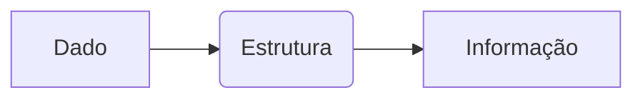

# Revisão de Lógica e Funções
## Aula 02

---

## 🎯 Objetivos
- Compreender Revisão de Lógica e Funções
- Ver exemplos práticos
- Resolver problemas

---

## 💡 Introdução
Explicação conceitual breve...

---

## 📊 Diagrama



---

## 💻 Código Exemplo

```c
// Código aqui
```

---

## 🏁 Conclusão
- Revisão dos pontos principais

---

<!-- .element: class="fragment" -->
# Próxima Aula: ...
