# Árvores – Conceitos Básicos
## Aula 11

---

## 🎯 Objetivos
- Compreender Árvores – Conceitos Básicos
- Ver exemplos práticos
- Resolver problemas

---

## 💡 Introdução
Explicação conceitual breve...

---

## 📊 Diagrama

```mermaid
graph LR
    A[Dado] --> B(Estrutura)
    B --> C[Informação]
```



---

## 💻 Código Exemplo

```c
// Código aqui
```

---

## 🏁 Conclusão
- Revisão dos pontos principais

---

<!-- .element: class="fragment" -->
# Próxima Aula: ...
